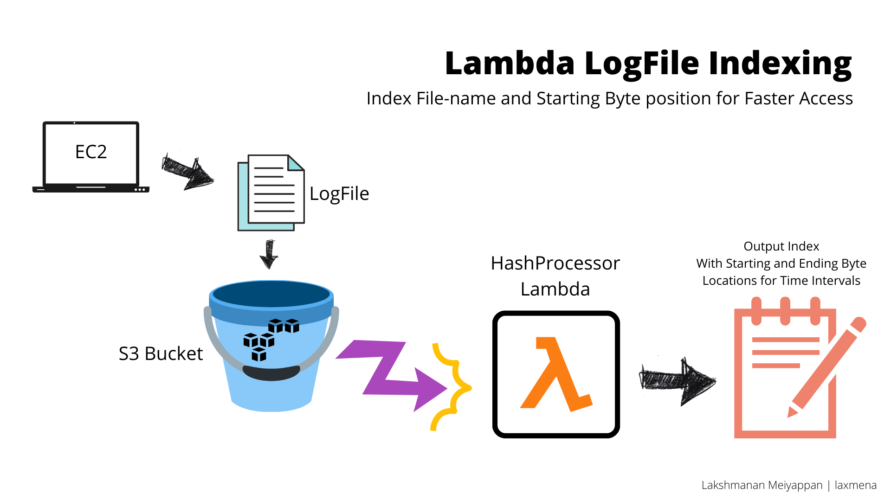
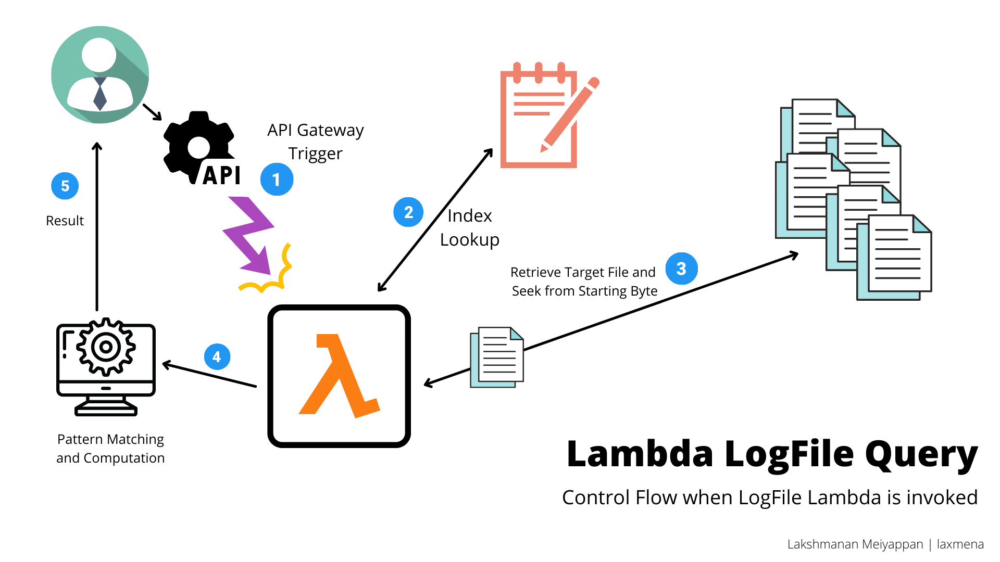

# AWS Lambda Functions

## Lambda 1: Indexing Lambda

**Functionality:**
1. Triggers when a new document is added to the s3.
2. Reads the log file, and creates an index of the document. 
3. Index contains:
    - key: timestamp (HH:MM:SS)
    - value: (file name, start btye, end byte)
4. New Index is created for each date.
5. Index is stored as pickle file in s3 bucket.

## Lambda 2: gRPC Lambda

1. Lambda function receives the request and decodes the Protobuf object.
2. Lambda function uses the Protobuf object to compute the result.
3. Lambda function looks up the Date TimeStamp in the **index(pickle file)** and gets the LogFileName, startByte and endByte.
4. If the Date TimeStamp is found in the pickle file, it reads the LogFile from S3 and returns the result - True (as protobuf object).
5. If the Date TimeStamp is not found in the pickle file, it returns False (as protobuf object).

## Lambda 3: REST Lambda
1. Supports the following HTTP methods: GET, POST
2. Supports the following HTTP headers:
   - Content-Type: application/json
3. Requires the following input parameters:
   - date: YYYY-MM-DD
   - timeStamp: HH:MM:SS
   - window: integer value in minutes
4. Checks LogFile Index to get the list of files, and starting byte position for the given timestamp within the file.
5. Loads the file from S3 bucket, from the starting byte position.
6. Checks for all pattern matches in the logfiles in the specified window.
7. Converts the matches into md5 hashes and returns it to client.
8. If there is no logs available for specified window, it returns 404 with message.

## How to Deploy Python Functions in AWS Lambda

Read this [article](https://towardsdatascience.com/how-to-install-python-packages-for-aws-lambda-layer-74e193c76a91) to deal with dependencies, and requirements for gRPC lambda. 

Useful AWS Article: https://docs.aws.amazon.com/lambda/latest/dg/python-package.html
