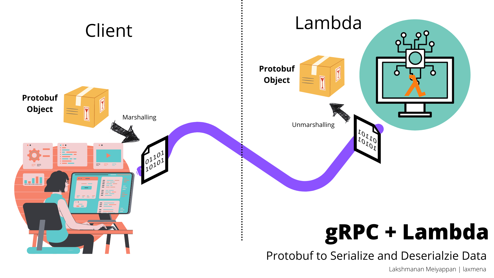

# AWS Lambda Implementation with gRPC ProtoBuf

- __Author__: [Lakshmanan Meiyappan](https://laxmena.com)
- __Email__: [lmeiya2@uic.edu](mailto:lmeiya2@uic.edu)

This project uses AWS Lambda to implement gRPC based request using Protobuf, built with Scala and sbt.

## Dependencies

- Scala 2.13.4
- SBT 1.5.2
- slf4j-api 2.0.0
- typesafe config 1.4.1
- aws-lambda-java-core 1.2.1
- aws-lambda-java-events 3.10.0
- scalapb-runtime-grpc

## Basic Definitions:
- AWS Lambda is a Serverless Application Model (SaaS) that allows you to run serverless code on AWS.
- gRPC is a framework for building high-performance, distributed, and fault-tolerant applications.
- Protobuf is a language for encoding and decoding data structures.
- Scala is a general-purpose programming language that is class-based, object-oriented, and strong-typed.

## Functionality

gRPC requires a server and a client. The server is the one that receives the request and sends the response. So, we need 
a gRPC server to be active. But implementing in AWS Lambda is not possible. gRPC Server implementation is not possible 
for various reasons - 
1. It defeats the purpose of AWS Lambda of serverless computing
2. We do not control the ports in AWS Lambda
3. AWS Lambda is billed based on the number of requests, execution time and memory consumed. So, even if we find a 
workaround to implement gRPC server in AWS Lambda, it will result in high execution costs.

So, we need to find a workaround to make the language independent distributed computing work.  To accomplish that, 
we make use of Protobuf - to get language independent representation of data structures.

We then transfer this Protobuf objects to the AWS Lambda function through HTTP as encoded data. In the Lambda, we 
receive the encoded data and decode it to the Protobuf object. We then make use of the data to compute the result and 
return the result back to the client in similar manner.

Here is the higher level workflow of the project:



1. Protobuf object from client is encoded, and sent in the body of the HTTP request
2. Lambda function receives the encoded data and decodes it to the Protobuf object
3. Lambda function uses the Protobuf object to compute the result
4. Lambda function encodes the result and sends it back to the client
5. Client receives the encoded result and decodes it to the Protobuf object
6. Client uses the Protobuf object to get the result

## Lambda Function Workflow and Logic

Note: All Lambda Functions are written in Python. 

Lambda functions source code is in the [LambdaCode](./LambdaCode) directory.

Please refer this [article](https://towardsdatascience.com/how-to-install-python-packages-for-aws-lambda-layer-74e193c76a91), on how to bundle the Lambda functions with dependencies, as AWS Lambda does not have gRPC 
packages available by default. 

Find the Lambda Functions here: 
1. [Indexing Lambda Function](https://github.com/laxmena/AWS-Lambda-with-gRPC/blob/master/LambdaCode/Indexing%20Lambda/lambda_function.py)
2. [gRPC ProtoBuf Lambda Function](https://github.com/laxmena/AWS-Lambda-with-gRPC/tree/master/LambdaCode/gRPC%20Lambda)
3. [REST Lambda Function](https://github.com/laxmena/AWS-Lambda-with-gRPC/tree/master/LambdaCode/Rest%20Lambda)

### Indexing Log file for faster access:


LogProcessor program in EC2 machine generates Log files, and stores them in S3 bucket. We have a second Lambda that 
is triggered when there is a new file added to the S3 bucket. It reads the file and indexes the log file. It creates
key-value pairs of the TimeStamp(HH:MM:SS) and the value as (LogFileName, startByte, endByte), and stores them in 
a pickle file.  

This significantly speeds up the lookup time for the future requests

### gRPC ProtoBuf Lambda Function Workflow:


__Steps:__

1. Client triggers API Gateway to send the request to the Lambda function.
2. Lambda function receives the request and decodes the Protobuf object.
3. Lambda function uses the Protobuf object to compute the result.
4. Lambda function looks up the Date TimeStamp in the pickle file and gets the LogFileName, startByte and endByte.
5. If the Date TimeStamp is found in the pickle file, it reads the LogFile from S3 and returns the result - True (as protobuf object).
6. If the Date TimeStamp is not found in the pickle file, it returns False (as protobuf object).


## Youtube Demo Video

Please find the __Documentation__ of this Project hosted in Github pages here: [Documentation](https://laxmena.github.io/AWS-Lambda-with-gRPC/com/laxmena/LambdaClient.html)

__Demo and Walk-through Video:__

### Part 1:

**[gRPC Protobuf + AWS Lambda for LogQuery Processing | Part 1](https://youtu.be/YFPVKTBbWOY)**

[](https://youtu.be/YFPVKTBbWOY)

### Part 2
**[How Lambda Functions work | Part 2](https://youtu.be/5hdhwfg5ytQ)**

[](https://youtu.be/5hdhwfg5ytQ)


## How to Run "AWS-Lambda with gRPC and REST"?

#### Step 1: Clone the Project
```bash
git clone https://github.com/laxmena/AWS-Lambda-with-gRPC-Rest.git
cd AWS-Lambda-with-gRPC-Rest
```

#### Step 2: Execute the following command to compile and run the project
```bash
sbt clean compile 
sbt test
sbt "run YYYY-MM-DD HH:MM:SS window"
```

- First argument is the Date in the format YYYY-MM-DD
- Second argument is the time in the format HH:MM:SS
- Third argument is the window, integer value in seconds. (Which is just placeholder for this gRPC implementation.)

#### Sample Output:

This is a sample output after running the following command:
```shell
sbt "run 2021-11-05 22:19:23 1"
```

Output:

```shell
[info] running com.laxmena.LambdaClient 2021-11-05 22:19:23 1
17:22:04.223 [run-main-0] INFO  java.lang.Class - LambdaClient started
17:22:04.582 [run-main-0] INFO  java.lang.Class - date: 2021-11-05, time: 22:19:23, window: 1
17:22:04.618 [run-main-0] INFO  java.lang.Class - Loaded Config
17:22:04.621 [run-main-0] INFO  java.lang.Class - Loaded Grpc Config
17:22:04.625 [run-main-0] INFO  java.lang.Class - Starting AWS Protobuf Client
17:22:09.955 [run-main-0] INFO  java.lang.Class - req: HttpResponse([B@50166a01,200,TreeMap(Apigw-Requestid -> Vector(IWg5OiP9oAMEMWA=), Connection -> Vector(keep-alive), Content-Length -> Vector(2), Content-Type -> Vector(text/plai
n; charset=utf-8), Date -> Vector(Fri, 05 Nov 2021 22:22:25 GMT), Status -> Vector(HTTP/1.1 200 OK)))
17:22:09.976 [run-main-0] INFO  java.lang.Class - LogQueryResponse: LogQueryResponse(true,UnknownFieldSet(Map()))
17:22:09.978 [run-main-0] INFO  java.lang.Class - LogQueryResponse is available

```

## Resources:

- https://cloud.google.com/blog/products/api-management/understanding-grpc-openapi-and-rest-and-when-to-use-them
- https://www.freecodecamp.org/news/rest-is-the-new-soap-97ff6c09896d/
- https://aws.amazon.com/blogs/opensource/the-versatility-of-grpc-an-open-source-high-performance-rpc-framework/
- https://youtu.be/MgQDeKwTnDQ
- https://www.youtube.com/c/amazonwebservices/videos
- https://stackoverflow.com/questions/47764448/how-to-test-grpc-apis
- https://www.scala-sbt.org/1.x/docs/Installing-sbt-on-Linux.html
- https://docs.aws.amazon.com/lambda/latest/dg/python-package.html
- https://towardsdatascience.com/how-to-install-python-packages-for-aws-lambda-layer-74e193c76a91